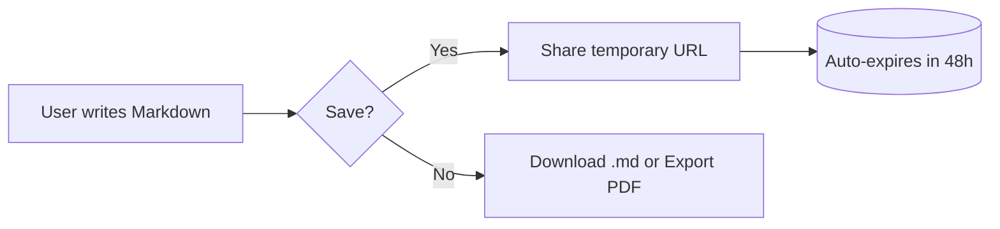
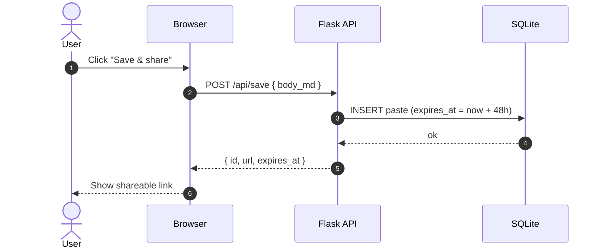
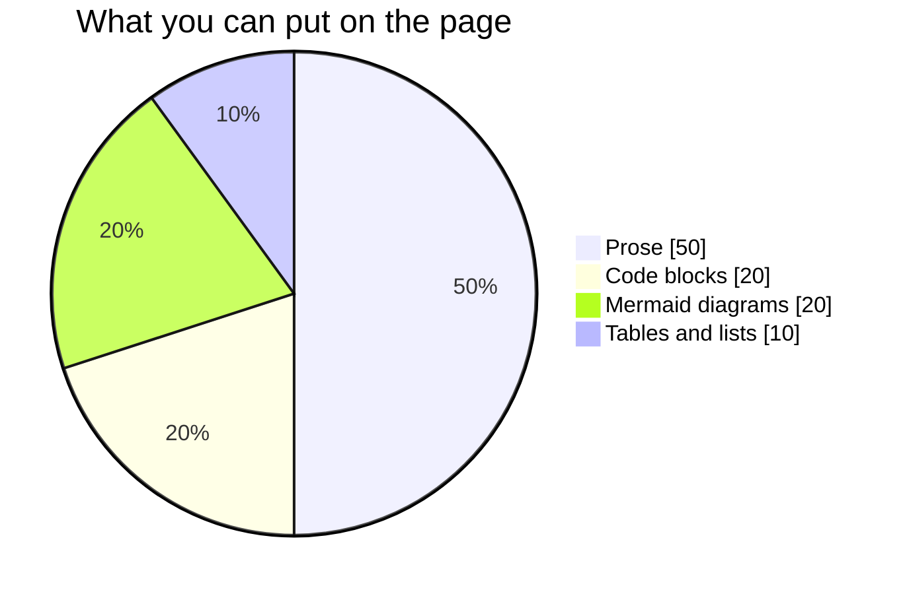
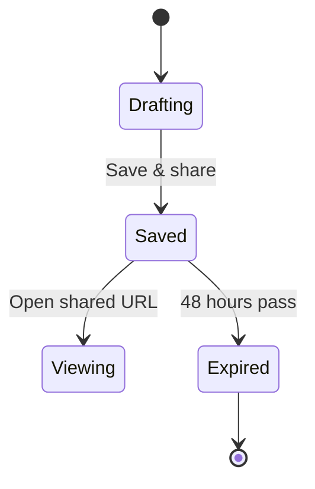

# Welcome to markdown.kuberscan.com

A quick tour of what you can do here. **Edit this text on the left**.
The preview on the right updates as you type. Hit **Save & share** to
get a temporary URL anyone can open for the next 48 hours.

---

## Markdown basics

**Bold**, *italic*, ~~strikethrough~~, `inline code`, and
[links](https://kuberscan.com).

Lists work the way you'd expect:

- Unordered item one
- Unordered item two
  - Nested item
- Back to the top level

1. Numbered item
2. Another one
3. And one more

Task lists are supported too:

- [x] Live preview
- [x] Save & share with auto-expiry
- [x] Export PDF (Default or Styled)
- [x] Draggable splitter between panes
- [ ] Add your own next idea

Blockquote:

> "Markdown is intended to be as easy-to-read and easy-to-write as is feasible."
> *John Gruber*

A simple table:

| Action | How |
|---|---|
| Save | Click **Save & share** or press Cmd / Ctrl + S |
| Resize panes | Drag the divider between Markdown and Preview |
| Reset editor | Click **Reset** in the toolbar |
| Toggle theme | Click the ☀ / ☾ icon |

Fenced code blocks with syntax highlighting:

```python
def greet(name: str) -> str:
    return f"hello, {name}"

print(greet("world"))
```

```javascript
const sum = (a, b) => a + b;
console.log(sum(2, 3));  // 5
```

```bash
# Save the editor content as a paste
curl -sX POST https://markdown.kuberscan.com/api/save \
     -H 'Content-Type: application/json' \
     -d '{"body_md": "# Hello from curl"}'
```

---

## Mermaid diagrams

Anything inside a fenced ` ```mermaid ` block renders as an inline SVG
diagram. The full catalog of diagram types is at
[mermaid.js.org](https://mermaid.js.org). Here are four to give you a
feel for what's possible.

### Flowchart



### Sequence diagram



### Pie chart



### State diagram



---

## Try it

Click **Reset** in the toolbar to clear this welcome content, or just
start editing on the left to make it your own. When you're ready, hit
**Save & share** to get a temporary URL that auto-expires in 48 hours.
